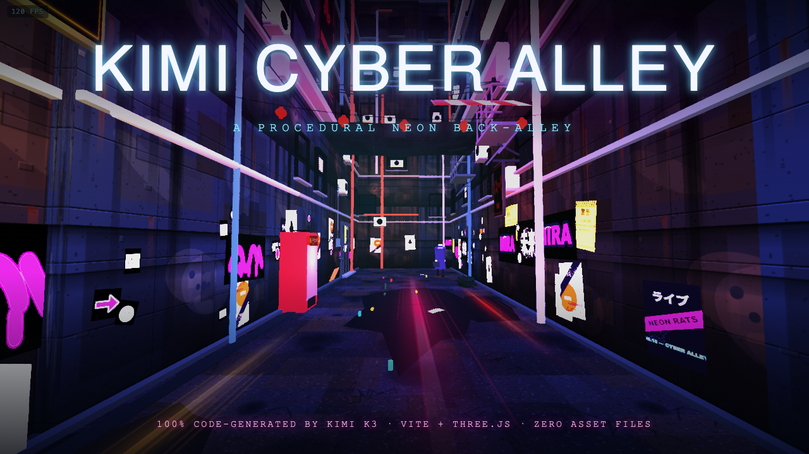
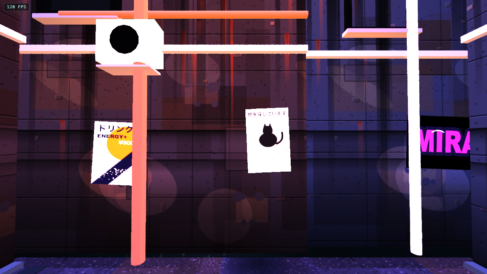
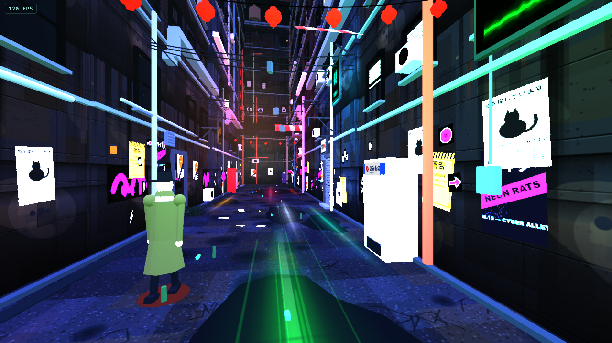
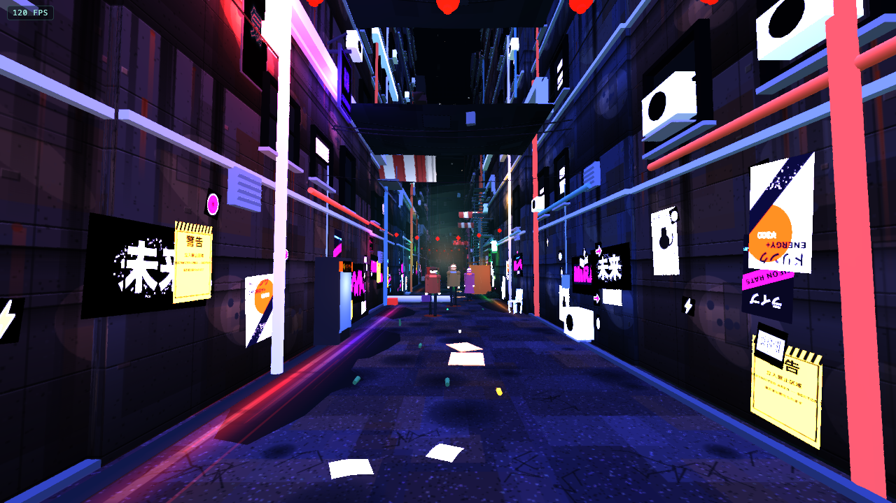

# Kimi Cyber Alley



**[▶ Play it live](https://kimi-cyber-alley.vercel.app/)** · [Asset viewer](https://kimi-cyber-alley.vercel.app/viewer)

A fully explorable, first-person cyberpunk back-alley that runs in the browser — neon signs, rain-slick asphalt, a noodle stand, wandering pedestrians, flying traffic, drifting smog, and a starfield above the rooftops. **Every single asset is generated from code at runtime: zero image files, zero model files, zero downloads.**

## Screenshots

| | |
|---|---|
|  |  |
|  | |

## How it was built

This project was created **entirely by [Kimi K3](https://www.moonshot.ai/) (`moonshotai/Kimi-K3`) inside a single ChatGPT Desktop (Codex) chat session**, routed through [togetherlink](https://github.com/Nutlope/togetherlink) — a local proxy that lets the Codex desktop app talk to Together AI models. No human wrote any of the code; the human steered with prompts, reference screenshots, and blunt visual feedback while the model wrote, ran, screenshotted, and iterated on every file.

### The original prompt

> *"Build a complete, explorable 3D cyberpunk back-alley as a Vite + Three.js project."*

### Extra guidance given along the way

- Three Cyberpunk-2077-style reference screenshots, with the standing instruction: *"go do it, don't stop until close to these assets I gave you as references."*
- A 20-point art-direction brief: believable architecture (windows, doors, storefronts, pipes, fire escapes), verticality, realistic materials, wet-ground neon reflections, neon signs as actual light sources, varied warm/cold lighting, atmospheric depth (fog, steam, dust, bloom), environmental density, layered signage, storefront storytelling, a strong focal point, upgraded characters, surface aging, and restrained post-processing.
- Iterative visual feedback on every pass: *"corridor too thin"*, *"no stars in the sky"*, *"too static — no moving lanterns, no NPCs"*, *"floor texture is super stretched"*, *"I don't see a wall at the start of the street, I see infinite void"*, *"too bright and a bit ugly — I preferred this view"*.
- Process constraints: work only on `main`, push progress regularly (every push auto-deploys to Vercel), verify each asset visually in a per-model viewer page (`/viewer?model=xyz`), and use subagents to parallelize the 20-point brief.

### What's under the hood

- **Vite + Three.js 0.178 + TypeScript**, no other runtime dependencies.
- **100% procedural assets** — all textures are Canvas2D-generated (asphalt, brick, tile, painted metal, grime, posters, graffiti, neon sign faces), all geometry is built from primitives/lathes/extrusions with a seeded PRNG (`mulberry32`) so the alley is deterministic.
- **Custom toon shading** with hue-shifted shadow bands, plus an HDR post pipeline: UnrealBloom, ink-from-depth outlines, teal/amber split-tone grade, S-curve contrast, filmic highlight rolloff, shadow desaturation, vignette, FXAA.
- **Living scene** — flickering neon with precomputed buzz schedules, wind-swayed lanterns and noren curtains, NPC pedestrians with walk cycles/umbrellas/briefcases, a cook stirring at the noodle stand, steam vents, rain, drifting smog banks, and flying cars crossing the sky corridor.
- **Mobile support** — twin-stick touch controls, iOS `100dvh`/visualViewport handling, always-on FPS counter.
- **Verification tooling** — a Playwright screenshot harness (`scripts/screenshot.py`) that teleports the camera through 10 waypoints so the model could *see* and judge its own work each iteration, plus a per-asset viewer at `/viewer`.

## Run it

```bash
bun install
bun run dev        # http://localhost:5173
bun run typecheck  # tsc --noEmit
bun run build      # production build
```

Desktop: WASD to move, SHIFT to run, mouse to look. Mobile: left stick to move, drag right side to look.

## Credits

- **All code, assets, textures, and art direction iteration:** Kimi K3 (via Together AI), prompted through [togetherlink](https://github.com/Nutlope/togetherlink) in the Codex desktop app.
- **Human role:** prompts, reference images, taste, and complaints about the corridor being too thin.
